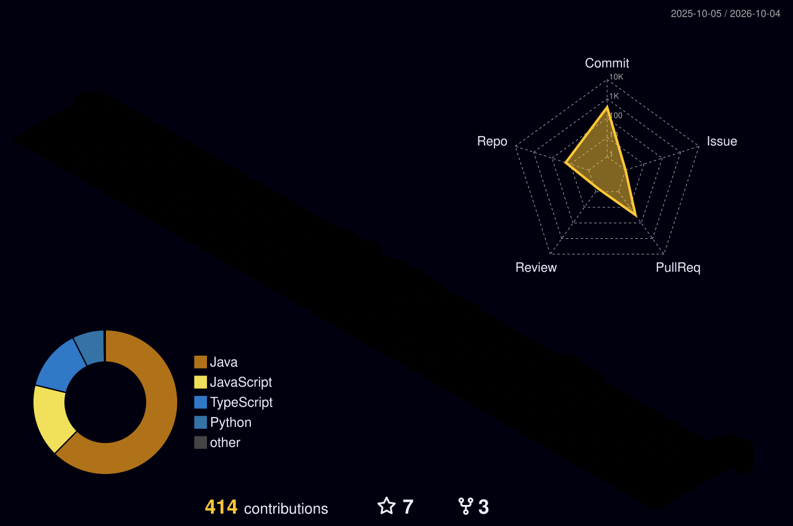

<h1 align="center">Hi 👋, I'm Shivansh Garg</h1>
<h3 align="center">Full-Stack Software Engineer | CS Undergraduate</h3>

  

 

<!-- PROFILE-SVG-START -->
<table align="center">
  <tr>
    <td valign="top" align="center">
      
    </td>
    <td valign="top" align="center">
      
    </td>
  </tr>
</table>

  

<!-- PROFILE-SVG-END -->

I am a passionate Full-Stack Software Engineer and a Computer Science undergraduate at Chitkara University (CGPA: 10.00/10). I specialize in JavaScript, TypeScript, React, Node.js, and Java. I love building scalable applications, designing robust APIs, and creating seamless user experiences.

## 🚀 About Me
- 🔭 I’m currently a B.E. Computer Science student at Chitkara University (Kalvium Software Product Engineering Track).
- 💻 Previously worked as a **Full-Stack Software Engineer at Kalvium Labs**, where I built a unified productivity platform consolidating multiple enterprise applications by integrating Microsoft Graph API and Google Workspace APIs.
- 🏆 **Recent Win:** Winner of **Build with Bharat 3.0**.
- 💡 Experienced with Low-Level Design (LLD), UAT cycles, and agile collaborative team environments.

## 💻 Projects

### OpenLearning AI 🚀
> An intelligent aggregation layer that transforms any topic or paid course into a structured, free, and interactive learning curriculum.

**Key Features:** Instant curriculum generation, course extraction, context-aware neural tutor, real-time voice mentorship (Gemini Live), automated quizzes, and study schedule builder.  
**Tech Stack:** React, TypeScript, Node.js, Python (FastAPI), Crawl4AI, Gemini 2.5 Flash, Supabase.

### Notora
*Collaborative academic notes platform (React.js, Node.js, MongoDB, Socket.io)*

**Key Features:** Centralized platform for students to upload, search, and download lecture notes, featuring real-time chat (Socket.io) and OCR-based document search. Reached **100+ active users** and **1,700+ page views** within weeks.

**Tech Stack:** React.js, Node.js, Express, MongoDB, Socket.io, Google OAuth + JWT, Netlify/Render.

## 🏆 Achievements & Hackathons
- 🥇 **Winner**, Build with Bharat 3.0
- 🏅 **Finalist**, Hack4Delhi 2026 (Top 30/4,500+)

 

### 💻 Languages and Tools

  
  
  
  
  
  
  
  
  
  

### 📊 GitHub Stats

  
  

 

  

 

### 🌟 3D Contribution Graph

  

 

### 📫 Connect with me:

